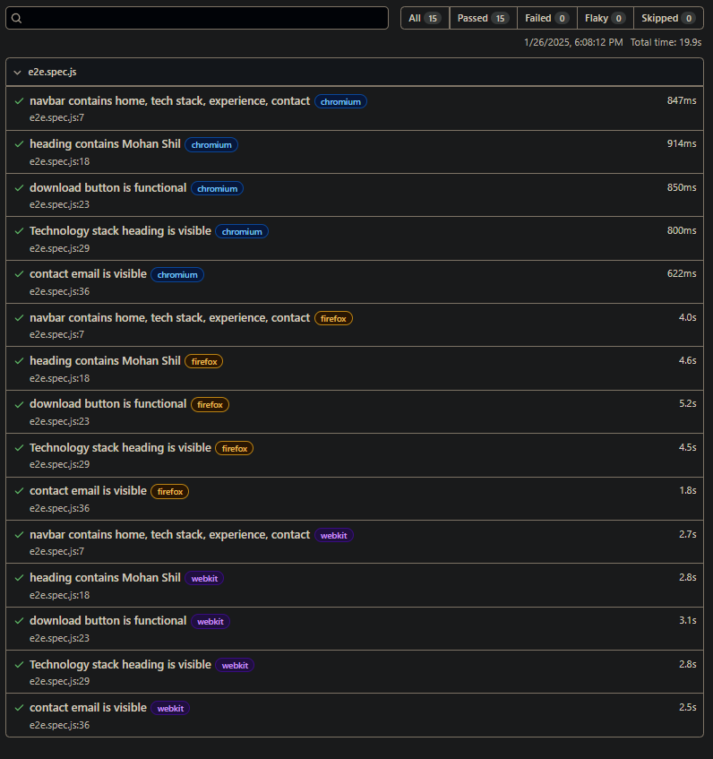

# Automation QA - Sample Test Suite

> Platform: [Mohans' Land](https://mohanshil.vercel.app/)

## Automation Framework: Playwright

Language: JavaScript

### Running the Tests

To install dependencies and execute the test suite, run the following commands:

```bash
npm install
npm test
npm run test
```

### Viewing the Report

To view the generated test report, download it from the following directory:

`/playwright-report`


